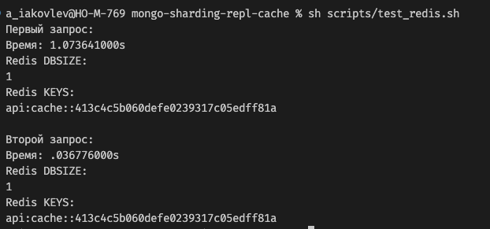

# pymongo-api

## Запуск

```shell
docker compose up -d --build
```

Инициализация replica sets, настройка шардинга, настройка репликации и заполнение БД тестовыми данными выполняется автоматически через init-контейнеры.

## Проверка

Локально: http://localhost:8080

Проверка работы кэша:
```shell
sh scripts/test_redis.sh
```


